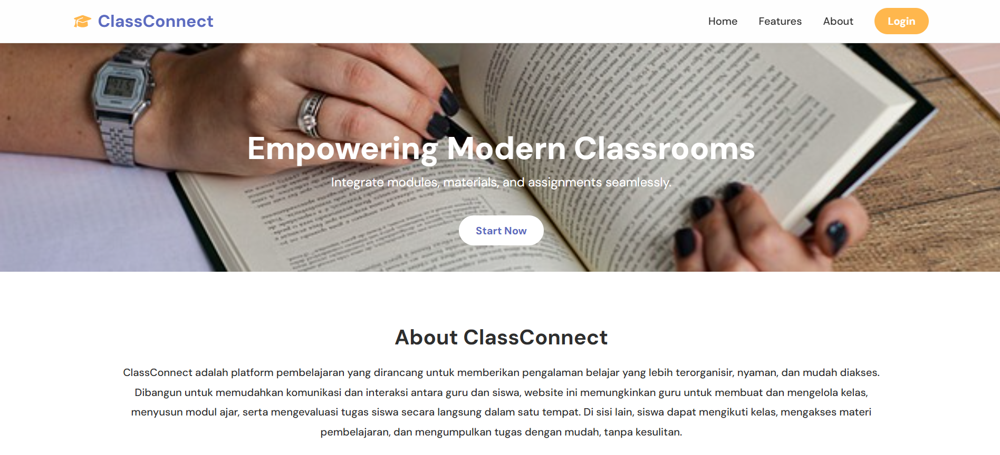
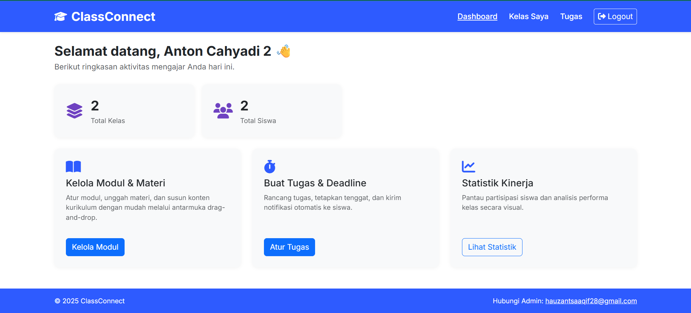

# 🎓 **ClassConnect — Integrated Learning Platform**

**ClassConnect** is a user-friendly, integrated learning platform designed to simplify and enhance the learning experience for both teachers and students. With features that allow seamless interaction, **ClassConnect** empowers teachers to create and manage classes, design learning modules, assign tasks, and evaluate students—all within a single platform. Students can easily follow classes, access materials, and submit their assignments online with just a few clicks.

> 📚 **ClassConnect**: Bridging the gap between teachers and students, making learning more accessible and organized.



---

## 🚀 **Key Features**

- 🖥️ **User-Friendly Interface**: Intuitive design for both teachers and students to navigate and utilize.
- 📚 **Class and Module Management**: Teachers can create, organize, and manage classes and learning modules.
- 📝 **Task Assignment & Evaluation**: Teachers can assign tasks, review submissions, and provide feedback.
- 💻 **Student Access**: Students can access materials, attend classes, and submit assignments directly on the platform.
- 🌐 **Built with Bootstrap, PHP, and MySQL**: A modern and responsive platform ensuring a seamless experience.

---

## 🔧 **Getting Started with ClassConnect**

Welcome to **ClassConnect**! Here's how you can start using the platform.

### 1. **Visit the Website**

- Head to the **ClassConnect Web App** at [https://classconnect.infinityfreeapp.com/](https://classconnect.infinityfreeapp.com/).

### 2. **Sign Up or Log In**

- If you don’t have an account, click on the **Sign Up** link to create one. Otherwise, log in using your existing credentials.

### 3. **For Teachers**:

- **Create a Class**: Once logged in, you can create a new class by clicking on the **Create Class** button and adding students to it.
- **Create Learning Modules**: Add and organize materials in various modules. You can also set tasks and deadlines.
- **Evaluate Assignments**: Review the assignments submitted by students, provide feedback, and grade them.

### 4. **For Students**:

- **Join Classes**: Once registered, you can join available classes and start learning.
- **Access Learning Materials**: Browse and read through the modules created by your teachers.
- **Submit Assignments**: Upload your completed assignments directly to the platform.

---

## 🧰 **Tech Stack**

- **Frontend**: HTML, CSS, and Bootstrap
- **Backend**: PHP (Native) with MySQL database
- **Hosting**: Free hosting via InfinityFreeApp
- **Database**: MySQL for storing user data, class info, assignments, etc.

---

## 🎯 **Why Choose ClassConnect?**

- **Comfort**: Easy to navigate, no steep learning curve for both teachers and students.
- **Convenience**: Everything you need for managing classes, tasks, and assignments in one place.
- **Integration**: Seamlessly connects students and teachers, creating a smooth workflow.

---



## 🧑‍🏫 **For Teachers and Students**

- **Teachers**: Save time on administrative tasks, and focus more on teaching with the platform’s easy-to-use tools for class management, content creation, and evaluation.
- **Students**: Access your materials and assignments from anywhere, collaborate with classmates, and stay on top of your learning schedule.

---

## 🧑‍💻 **Running ClassConnect Locally (For Developers)**

To set up and run ClassConnect on your local machine, follow the steps below:

1. **Clone the Repository**:

   ```bash
   git clone https://github.com/YourRepo/ClassConnect.git
   cd ClassConnect

   ```

2. **Set Up the Database:**

- Create a MySQL database and import the SQL file found in the database folder.

3. **Edit Configurations:**

- Update the database connection settings in the config.php file.

4. **Start the Local Server:**

- Use a local PHP server like XAMPP or MAMP to run the website.

## 🚨 **Need Help?**

If you encounter any issues or have questions, feel free to reach out me at [hauzantsaaqif28@gmail.com](mailto:hauzantsaaqif28@gmail.com).

---

## 🧠 **Future Features**

We're continually working on enhancing **ClassConnect**! Some upcoming features include:

- 🌍 **Mobile App Integration**: Access ClassConnect from your mobile devices.
- 🗣️ **Real-Time Communication**: Implement chat and messaging between students and teachers.
- 🏆 **Gamification**: Add badges and leaderboards to make learning more fun and competitive.

---

## 📄 **License**

This project is licensed under the **MIT License** — feel free to use, modify, and distribute with proper attribution.

---

> "Empowering teachers, enriching students—**ClassConnect** brings education closer to you."
